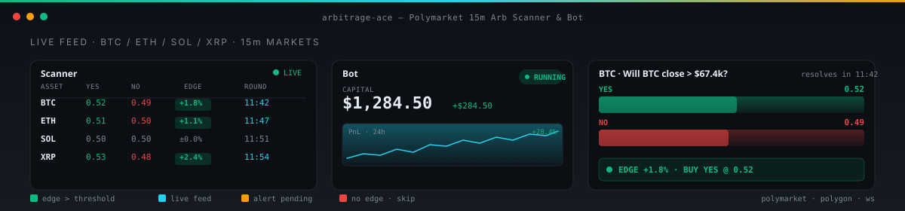

<p align="center">
  
</p>

<p align="center">
  <a href="LICENSE"></a>
  
  
  
  
  
  
</p>

<p align="center">
  <sub>Polymarket 15-minute crypto arb scanner &amp; bot — live edge, manual + automated execution.</sub>
</p>

---

<p align="center">
  
</p>

---

> **Spot mispricings on Polymarket 15-minute BTC / ETH / SOL / XRP markets, then trade them — by hand or on autopilot.**

## Table of Contents

- [Quick Start](#quick-start)
- [What this is](#what-this-is)
- [How it works](#how-it-works)
- [Project layout](#project-layout)
- [Tech stack](#tech-stack)
- [Configuration](#configuration)
- [Bot lifecycle](#bot-lifecycle)
- [Webhooks & alerts](#webhooks--alerts)
- [Testing](#testing)
- [Contributing](#contributing)
- [License](#license)

## Quick Start

```sh
git clone https://github.com/TR3-AI/arbitrage-ace.git
cd arbitrage-ace
npm install           # or: bun install
npm run dev           # http://localhost:5173
npm run build         # production bundle in dist/
npm run lint          # eslint flat config
```

## What this is

A focused trading cockpit for Polymarket's rolling 15-minute crypto markets. A live WebSocket
stream (`usePolymarketWebSocket`) feeds a scanner that flags YES+NO price pairs trading above a
configurable edge threshold. The same UI lets you size, preview, and fire orders manually,
or hand control to the bot for compounded, threshold-or-settlement exits.

## How it works

```text
WebSocket (Polymarket / Gamma)
        │
        ▼
usePolymarketWebSocket ──► MarketSnapshotCard  (YES / NO mid + spread)
        │
        ▼
Opportunity detector  ──► edge > threshold?  ──► decision alert + queue
        │
        ├─► ManualTrading tab      ──► preview → confirm → place
        │
        └─► Bot (start/stop)       ──► preflight → execution → exit logic
                                              │
                                              ▼
                                  PerformancePanel (PnL, ROI, win rate)
```

Three pages, one sidebar:

| Route               | Component                          | Purpose                                              |
|---------------------|------------------------------------|------------------------------------------------------|
| `/`                 | `pages/Index.tsx`                  | Manual trading cockpit, bot control, performance.    |
| `/decision-alerts`  | `pages/DecisionAlerts.tsx`         | Live decision feed with carousel + asset filter.     |
| `/settings`         | `pages/Settings.tsx`               | Signal, Telegram, webhook, price-alert configuration. |

## Project layout

```text
arbitrage-ace/
├── index.html
├── vite.config.ts                 # React SWC plugin + @ alias
├── tailwind.config.ts             # shadcn-ui theme tokens
├── components.json                # shadcn-ui registry
├── eslint.config.js               # flat config (typescript-eslint)
└── src/
    ├── App.tsx                    # router + providers
    ├── main.tsx                   # ReactDOM entry
    ├── index.css                  # tailwind base + shadcn tokens
    ├── pages/
    │   ├── Index.tsx              #   /         — manual + bot control
    │   ├── DecisionAlerts.tsx     #   /decision-alerts
    │   ├── Settings.tsx           #   /settings
    │   └── NotFound.tsx
    ├── components/
    │   ├── layout/                # TradingLayout, TradingSidebar
    │   ├── trading/               # Positions, Orders, Performance, MarketSnapshot…
    │   ├── bot/                   # BotControlPanel, EmergencyStop, PreflightChecks
    │   ├── config/                # ApiConfigPanel, RpcConfigPanel
    │   ├── settings/              # TokenSelector, ExitLogicPanel, PriceAlertsPanel…
    │   ├── alerts/                # DecisionAlertCard, DecisionAlertModal…
    │   ├── NavLink.tsx
    │   └── ui/                    # shadcn-ui primitives
    ├── hooks/
    │   ├── useBotState.ts         # canonical state, persisted to localStorage
    │   ├── usePolymarketWebSocket.ts
    │   ├── useApiConnection.ts    #   Polymarket CLOB API
    │   ├── useRpcConnection.ts    #   Polygon RPC + wallet
    │   ├── usePositions.ts, useOrderHistory.ts
    │   ├── useManualTrading.ts, useDecisionAlerts.ts
    │   ├── useDumpHedge.ts        #   dump-and-hedge strategy
    │   ├── useRoundTimer.ts, usePriceAlertMonitor.ts
    │   └── useSettings.ts, useAlertSound.ts
    ├── services/
    │   └── polymarketWebSocket.ts # raw WS client w/ reconnect
    ├── types/
    │   ├── trading.ts             # BotState, FilterParams, Compounding, ExitSettings…
    │   ├── manual-trading.ts      # MarketSnapshot, ScaleOrder
    │   ├── decision-alerts.ts     # AlertAsset, DecisionAlert
    │   └── price-alerts.ts
    └── lib/                       # utils, mockData, format helpers
```

## Tech stack

- **React 18** + **TypeScript 5.8** — strict mode, `@/*` path alias.
- **Vite 5** with `@vitejs/plugin-react-swc`.
- **Tailwind 3.4** + `tailwindcss-animate` + `tailwind-merge` (shadcn-ui).
- **shadcn-ui** components over Radix primitives (no Radix theming — class-variance driven).
- **react-router-dom 6** for client routing.
- **@tanstack/react-query 5** for server state.
- **recharts 2** for charts, **embla-carousel-react** for the alerts feed.
- **react-hook-form + zod** for validated forms; **sonner** for toasts.
- **lucide-react** icons.

No backend. State persists to `localStorage` under `crypto-arb-bot-state`.

## Configuration

Bot state is held in `useBotState` and persisted automatically. Defaults from `src/types/trading.ts`:

```ts
DEFAULT_FILTERS                 // edge threshold, min spread, max slippage
DEFAULT_COMPOUNDING             // reinvest %, growth cap
DEFAULT_EXIT_SETTINGS           // hold-to-settlement | sell-at-threshold
DEFAULT_POSITION_SIZE_SETTINGS  // sizing curve, max exposure
DEFAULT_DUMP_HEDGE_PARAMS       // dump-and-hedge strategy params
```

Runtime configuration lives in `src/pages/Settings.tsx`:

| Section          | What it does                                                  |
|------------------|---------------------------------------------------------------|
| Signal           | Token selector, filter thresholds, compounding toggle.        |
| Telegram Alerts  | Bot token + chat ID for outbound notifications.               |
| Webhook Listener | Inbound webhook URL — paste, persist, listen.                 |
| Price Alerts     | Symbol / direction / threshold rules, toggleable per rule.   |

Use **Reset** in the header to restore defaults.

## Bot lifecycle

`BotControlPanel` (`src/components/bot/BotControlPanel.tsx`) drives a strict state machine:

```text
stopped ──► starting ──► running ──► stopping ──► stopped
                  │                       │
                  └──► error ◄────────────┘
```

`PreflightChecks` must pass before `canStart` flips true. `EmergencyStop` short-circuits
the state machine back to `stopped` regardless of in-flight work.

Exit logic (`ExitLogicPanel`) accepts two modes:

- **hold_to_settlement** — let the contract resolve on Polygon.
- **sell_at_threshold** — auto-exit when PnL crosses the configured threshold.

## Webhooks & alerts

Inbound webhooks (`Settings → Webhook Listener`) and the dedicated `/decision-alerts` page
provide two channels for surfacing opportunities outside the SPA:

- **Webhook**: paste any HTTPS endpoint; payloads are validated client-side.
- **Decision Alerts**: card carousel with per-asset filter, auto-refresh, in-flight
  action tracking via `useDecisionAlerts`.

Both routes share the `DecisionAlertCard` component.

## Testing

```sh
npm run lint
```

TypeScript strict mode + ESLint flat config catch the common regressions. Add unit tests
under `src/**/__tests__/` if you extend the strategy code.

## Contributing

1. Fork, branch off `main`.
2. `npm install && npm run dev` — confirm the cockpit boots with mock data.
3. Open a PR against `main`. The "PRs welcome" badge is pink for a reason.

## License

[MIT](LICENSE). © TR3-AI.